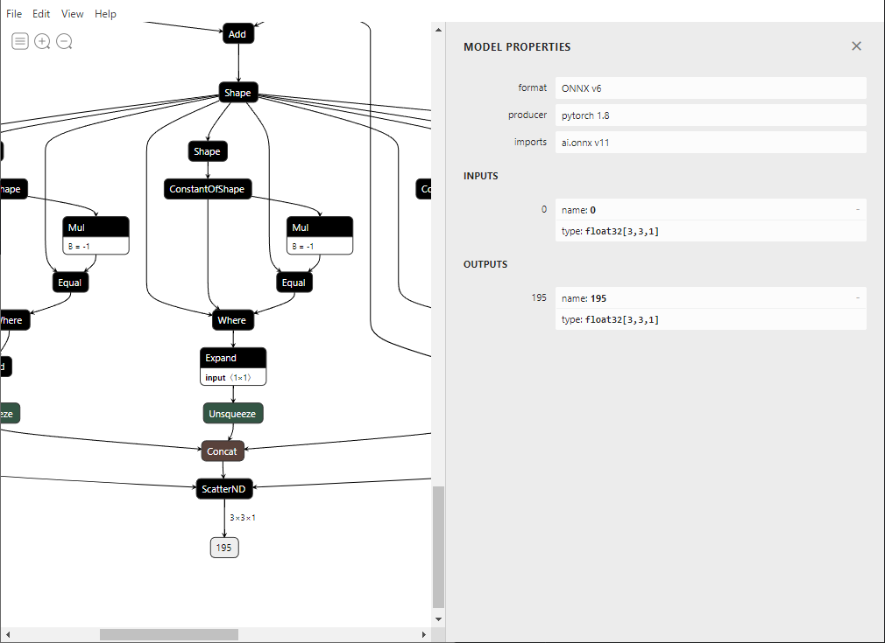
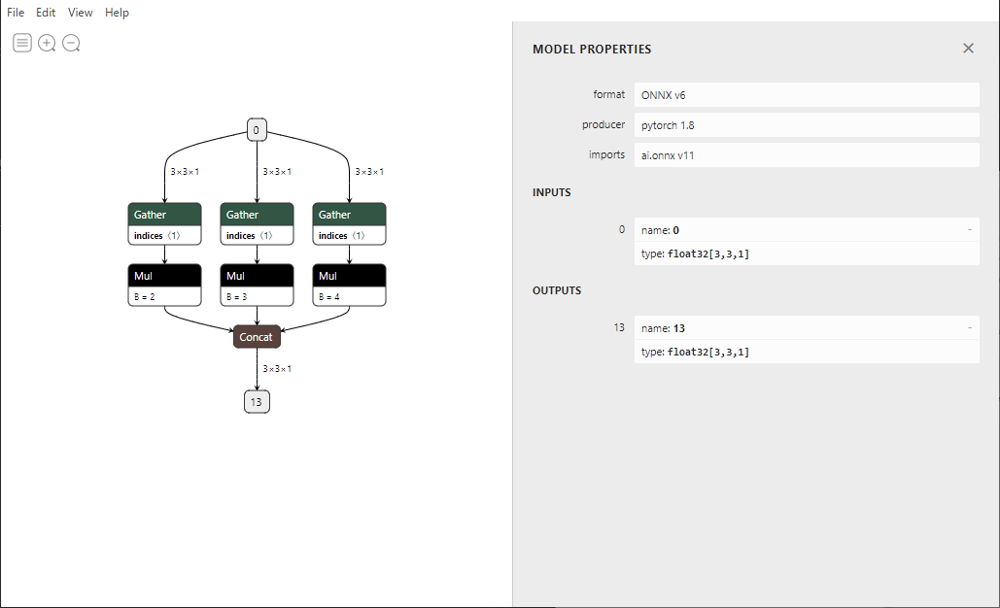

# pytorch_remove_ScatterND

pytorchのスライス代入操作をonnxに変換する際にScatterNDならないようにするサンプル。  
スライスしたtensorにそのまま代入してしまうとScatterNDになるため、計算結果をcatで新しいtensorにする。

# python version

Python 3.8.11

# setup

```
pip install -r requirements.txt
```

# Netron

## ScatterNdModel
  

## CatModel
  